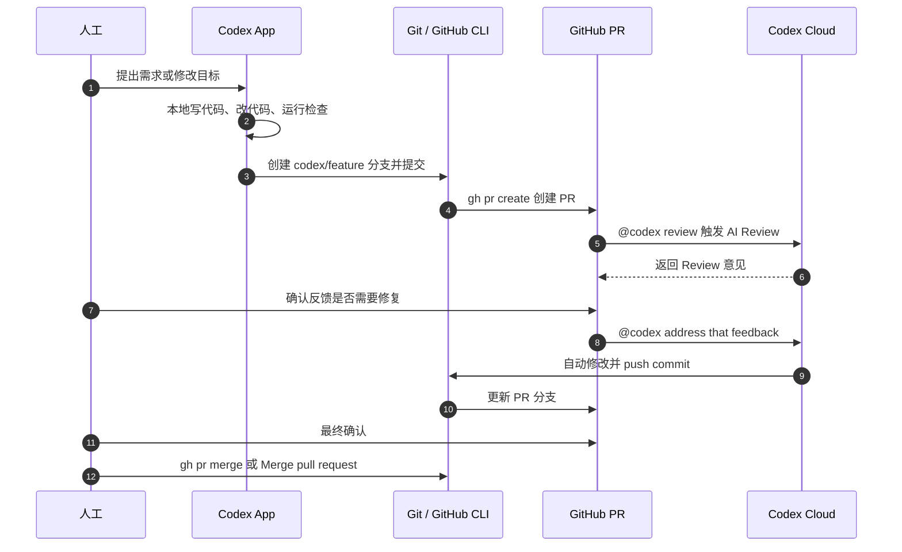

# Codex App 本地开发到 PR Review 流程

这份文档说明从 Codex App 本地开发，到 GitHub PR、Codex Cloud Review，再到人工确认和合并的标准流程。

## 总览

一句话概括：

GitHub CLI 负责把 PR 创建流程自动化，Codex Cloud 负责 PR Review 和修复，最后由人决定是否合并。

## 时序图



## 标准流程

1. 不直接改 `main`。
2. 每个需求新建 `feature/*` 或 `codex/*` 分支。
3. 使用 Codex App 在本地开发、修改代码、运行必要检查。
4. 使用 GitHub CLI 创建 PR。
5. 在 GitHub PR 中触发 Codex Cloud Review。
6. 如果 Review 发现问题，在 PR 中让 Codex Cloud 修复并提交。
7. 人工最终确认代码、检查状态和修改结果。
8. 合并 PR。

## 工具分工

| 工具 | 负责事项 |
| --- | --- |
| Codex App | 本地写代码、改代码、运行检查、提交分支 |
| GitHub CLI (`gh`) | 不打开网页也能创建 PR、查看 PR、检查状态、合并 PR |
| GitHub PR | 承载代码评审、讨论、检查状态和合并流程 |
| Codex Cloud | 云端 AI Review，根据反馈自动修复并提交 commit |
| 人工 | 最后确认需求、效果、风险，并决定是否合并 |

## 常用命令

### 安装和登录 GitHub CLI

```powershell
# 安装 GitHub CLI
winget install GitHub.cli

# 登录 GitHub
gh auth login
```

### 创建分支并推送

```powershell
# 创建分支
git checkout -b codex/fix-demo

# 推送分支
git push -u origin codex/fix-demo
```

### 创建和查看 PR

```powershell
# 创建 PR
gh pr create --base main --head codex/fix-demo --title "fix: demo" --body "AI generated changes"

# 在浏览器中查看 PR
gh pr view --web

# 查看检查状态
gh pr checks
```

## 在 PR 中使用 Codex

### 让 Codex Review

在 GitHub PR 评论中输入：

```text
@codex review
```

### 让 Codex 修复并提交

当 Review 有反馈需要处理时，在 PR 评论中输入：

```text
@codex address that feedback, run checks if available, and push a commit to this PR branch.
```

Codex Cloud 会根据反馈修改代码、运行可用检查，并把新的 commit 推送到当前 PR 分支。

## 合并前检查清单

- PR 不直接修改 `main`。
- 分支名清晰，例如 `codex/fix-demo` 或 `feature/login-flow`。
- Codex Cloud Review 已完成，关键反馈已处理。
- `gh pr checks` 没有失败项，或失败项已经明确可接受。
- 人工确认代码、效果和风险后，再执行 Merge。
