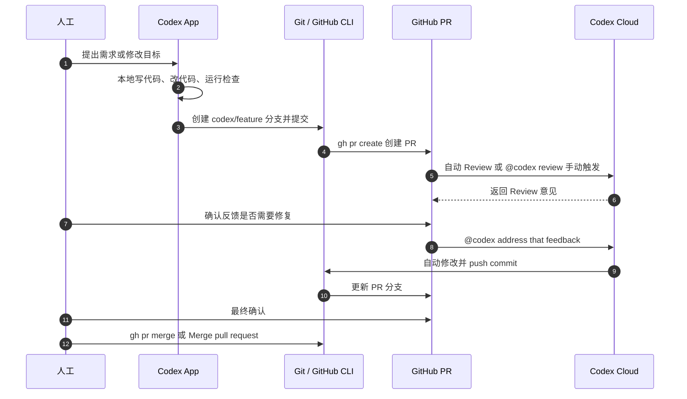

# Codex App 本地开发到 PR Review 流程

这份文档说明从 Codex App 本地开发，到 GitHub PR、Codex Cloud 自动 Review、Codex Cloud 修复并提交，再到人工确认和合并的标准流程。

## 总览

一句话概括：

GitHub CLI 负责把 PR 创建流程自动化，Codex Cloud 负责 PR Review 和修复，最后由人决定是否合并。

## 前置设置

在开始使用 Codex Cloud 做 PR Review 之前，需要先完成一次仓库级配置：

1. 打开 Codex Cloud，并关联 GitHub 账号或组织。
2. 为目标 GitHub 仓库完成 Codex Cloud 设置。
3. 配好该仓库的 Codex Cloud 环境，包括仓库访问权限、默认分支、依赖安装、测试 / 检查命令等。
4. 提交并保存仓库环境配置。
5. 进入 Codex 的代码审核设置页，为目标仓库开启 **Code review**。
6. 如果希望后续新建 PR 自动审核，再开启 **Automatic reviews**。

仓库环境配置很关键。Codex Cloud 需要知道如何拉取仓库、安装依赖、运行检查和把修改提交回 PR 分支；如果环境没有提交配置好，PR 里的自动 Review、根据反馈修复、运行检查或 push commit 都可能不生效。

开启 **Code review** 后，可以在 PR 评论里用 `@codex review` 手动触发审核。

开启 **Automatic reviews** 后，后续新建并进入 review 的 PR 会自动触发 Codex Review，不需要再手动评论 `@codex review`。

## 时序图



## 标准流程

1. 不直接改 `main`。
2. 每个需求新建 `feature/*` 或 `codex/*` 分支。
3. 使用 Codex App 在本地开发、修改代码、运行必要检查。
4. 使用 GitHub CLI 创建 PR。
5. 由 Codex Cloud 自动审核 PR，或在 GitHub PR 中用 `@codex review` 手动触发审核。
6. 如果 Review 发现问题，在 PR 中让 Codex Cloud 修复并提交。
7. 人工最终确认代码、检查状态和修改结果。
8. 合并 PR。

## 工具分工

| 工具 | 负责事项 |
| --- | --- |
| Codex App | 本地写代码、改代码、运行检查、提交分支 |
| GitHub CLI (`gh`) | 不打开网页也能创建 PR、查看 PR、检查状态、合并 PR |
| GitHub PR | 承载代码评审、讨论、检查状态和合并流程 |
| Codex Cloud | 云端 AI Review，根据反馈自动修复、运行检查并提交 commit |
| 人工 | 最后确认需求、效果、风险，并决定是否合并 |

## 常用命令

### 安装和登录 GitHub CLI

```powershell
# 安装 GitHub CLI
winget install GitHub.cli

# 登录 GitHub
gh auth login
```

### 创建分支并推送

```powershell
# 创建分支
git checkout -b codex/fix-demo

# 推送分支
git push -u origin codex/fix-demo
```

### 创建和查看 PR

```powershell
# 创建 PR
gh pr create --base main --head codex/fix-demo --title "fix: demo" --body "AI generated changes"

# 在浏览器中查看 PR
gh pr view --web

# 查看检查状态
gh pr checks
```

## 在 PR 中使用 Codex

### 让 Codex Review

如果仓库没有开启 **Automatic reviews**，或者需要额外再跑一次 Review，可以在 GitHub PR 评论中输入：

```text
@codex review
```

如果仓库已经开启 **Automatic reviews**，新建并进入 review 的 PR 会自动触发 Codex Review，通常不需要手动输入这条命令。

### 如何在 GitHub 侧看到 Review 结果

日常合并 PR 时，不建议每次都打开 Codex Cloud 确认结果。更稳的标准是：Codex Review 的结果应该能回写到 GitHub PR 页面，或者至少能在 GitHub 的检查状态里看到。

在 GitHub 侧建议看这些位置：

1. PR 的 Review 区域是否出现 Codex 提交的 review。
2. PR 的 Conversation / Timeline 是否有 Codex 的评论或活动记录。
3. PR 的 Checks 区域是否有 Codex 相关检查状态。
4. 使用 GitHub CLI 查看 PR review 和 checks。

```powershell
# 查看 PR 评论和 review 摘要
gh pr view --comments

# 查看 PR 的 review / merge / checks 状态
gh pr view --json latestReviews,reviewDecision,statusCheckRollup

# 查看检查状态
gh pr checks
```

如果 GitHub PR 里完全没有 Codex 的 review、comment 或 check，那么 GitHub CLI 也通常看不到 Codex 的结果。此时不要把“Codex Cloud 显示成功”直接当作合并依据，因为这个结果没有进入 GitHub 的 PR 审核闭环。

### 自动 Review 有问题时的表现

新建 PR 后，如果 **Automatic reviews** 正常触发，并且 Codex 发现需要处理的问题，结果会出现在 GitHub PR 的评论或 review 中。

常见表现是：

- 评论来自 `chatgpt-codex-connector[bot]`。
- 评论标题类似 `Codex Review`。
- 评论里会显示 `Reviewed commit`，用于说明审核的是哪个 commit。
- 具体问题会挂在对应文件和代码行附近。
- 问题会带优先级，例如 `P1`。
- 评论会说明为什么这是问题，以及建议如何修复。

例如，如果 `src/index.js` 里用了全角分号 `；` 或中文智能引号，导致 JavaScript 无法解析，Codex 可能会在 PR 里留下类似这样的 Review 意见：

```text
P1 Restore ASCII JavaScript delimiters

In any environment that executes src/index.js with a JavaScript parser,
the full-width ； after this statement is not a valid token,
so the file fails to parse before any code runs.
Replace these with ASCII JavaScript punctuation so the entrypoint can load.
```

看到这类评论时，不要直接 Merge。应先修复问题，或在 PR 里让 Codex Cloud 根据反馈自动修改并提交。

### 让 Codex 修复并提交

当 Review 有反馈需要处理时，可以直接在 PR 评论中 @Codex，让它修复代码、运行可用检查，并提交到当前 PR 分支。

中文写法也可以：

```text
@codex 帮我修复代码，并且提交到当前分支
```

英文写法：

```text
@codex address that feedback, run checks if available, and push a commit to this PR branch.
```

如果 Codex Cloud 仓库环境配置正确，Codex 会在 PR 里返回处理结果，通常包括：

- 修复摘要。
- 修改的文件和代码位置。
- 新提交的 commit。
- 已运行的检查命令和结果。

例如它可能会说明已经把智能引号换成 ASCII 引号，并运行了 `node --check src/index.js` 之类的检查。

### 异常排查

如果自动 Review 没触发、GitHub PR 看不到 Codex 结果，或者 @Codex 后没有成功修复并提交，建议优先排查：

- GitHub App 或 Codex Cloud 是否仍有该仓库的写评论 / 写 review 权限。
- 目标仓库是否已开启 **Code review** 和 **Automatic reviews**。
- PR 是否是开启 **Automatic reviews** 之后新建并进入 review 的 PR。
- PR 当前 commit 是否就是 Codex Cloud 完成审核的那个 commit。
- 手动评论 `@codex review` 后，GitHub 侧是否能收到 Codex 的 review。
- Codex Cloud 的仓库环境是否已经提交配置好，尤其是依赖安装和检查命令。

如果手动 `@codex review` 也无法把结果写回 GitHub，说明 GitHub 回写链路可能有权限或集成问题，需要先修复；否则这个自动 Review 不适合作为 Merge 前的强制判断标准。

如果 @Codex 可以收到指令但不能修复、不能运行检查或不能 push commit，优先检查 Codex Cloud 仓库环境是否已经提交配置好，以及该 GitHub App 是否有写入 PR 分支的权限。

## 合并前检查清单

- PR 不直接修改 `main`。
- 分支名清晰，例如 `codex/fix-demo` 或 `feature/login-flow`。
- Codex Cloud 仓库环境已提交配置好。
- Codex Cloud Review 已完成，并且对应当前 PR 的最新 commit。
- GitHub PR 页面或 `gh` 命令能看到 Codex Review 结果。
- Codex 没有发现需要处理的高优先级问题，或关键反馈已处理。
- `gh pr checks` 没有失败项，或失败项已经明确可接受。
- 人工确认代码、效果和风险后，再执行 Merge。
